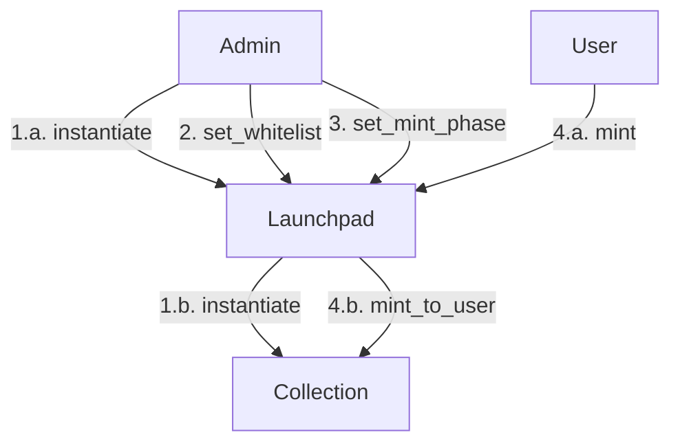

# NFT Marketplace

This repo contains smart contracts for a NFT Marketplace and Launchpad in a Cosmos blockchain using [CosmWasm](https://cosmwasm.com/).

## Maintainers

This repo is maintained by [Aura Network](https://aura.network).

## How it works

There are 4 contracts:
- cw2981-royalties: a modified cw2981-royalties of cw-nfts. We changed it to support contract-level royalties instead of token-level royalties.
- bidding-token: a modified cw20-base of [cw-plus](https://github.com/CosmWasm/cw-plus). We changed it to a warped token used only by marketplace contract.
- nft-marketplace: a NFT marketplace contract which allow any users to list their NFTs and offer others.
- launchpad: a NFT launchpad that allow creators to sell NFTs.

### Marketplace contract

This contract supports 2 functions:
- Users list NFTs for sale.
- Users make offer on others' NFTs.

For better user experience, we do not lock users' NFTs when they are listed on sale. This indeed can lead to issues with invalid listings. We will look in to ways to resolve those issues without compromise on UX. For the same reason, we also do not lock users' token when they make offers with those token.

### Launchpad contract

Current version of the launchpad uses a simple procedure for generating random NFT IDs. It is verifiable but not a true random number. For example, block proposer could manipulate the result by changing the order of executing mint transactions. However, given the low block time of Cosmos chain in general, it is mostly sufficient for 

## Contributing

Aura Network welcome any feedback for improving the contracts or fixing security issues.
Please raise issues and/or PRs. You can also join [Aura Network discord](https://aura.network/discord) for discussing any ideas and questions.
